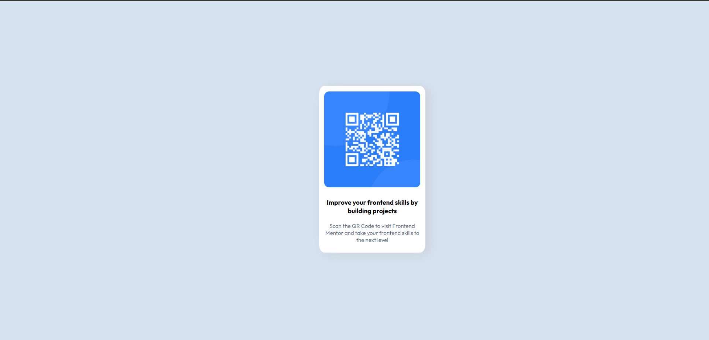
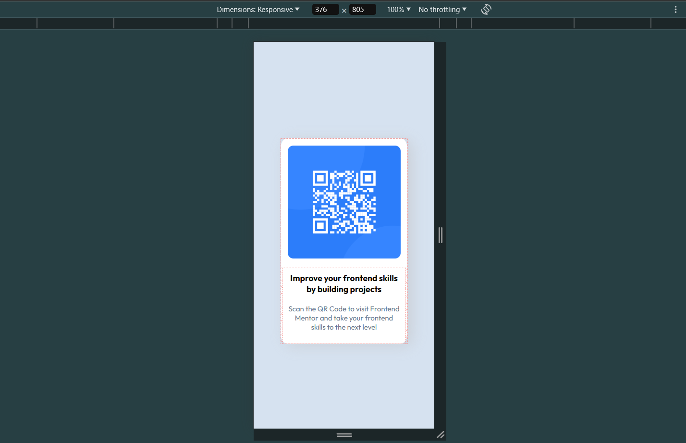

# Frontend Mentor - QR code component solution

This is a solution to the [QR code component challenge on Frontend Mentor](https://www.frontendmentor.io/challenges/qr-code-component-iux_sIO_H). Frontend Mentor challenges help you improve your coding skills by building realistic projects. 

## Table of contents

- [Overview](#overview)
  - [Screenshot](#screenshot)
  - [Links](#links)
- [My process](#my-process)
  - [Built with](#built-with)
  - [What I learned](#what-i-learned)
  - [Continued development](#continued-development)
  - [Useful resources](#useful-resources)
- [Author](#author)
- [Acknowledgments](#acknowledgments)

**Note: Delete this note and update the table of contents based on what sections you keep.**

## Overview

### Screenshot

### Desktop view


### Mobile view



### Links

- Live Site URL: [Add live site URL here](http://127.0.0.1:5500/qr-code-component-main/index.html)

## My process

### Built with

- Semantic HTML5 markup
- CSS custom properties
- Flexbox
- Mobile-first workflow

**Note: These are just examples. Delete this note and replace the list above with your own choices**

### What I learned

With this project I learn how to design a responsive element and the principles of Flexbox system design

My best code snippets to share with you!

```css
.container {
    margin: auto;
    position: absolute;
    top: 25%;
    left: 45%;
    right: 40%;
    display: flex;
    flex-wrap: wrap;
    justify-content: center;
    border-radius: 5%;
    box-shadow: 10px 5px 30px rgba(191, 190, 190, 0.5);
    background-color: hsl(0, 0%, 100%);
    overflow: hidden;
}
```

### Continued development

In the future I will improve in responsive design and elements position system.

**Note: Delete this note and the content within this section and replace with your own plans for continued development.**

### Useful resources

- [Example resource 1](https://www.example.com) - This helped me for XYZ reason. I really liked this pattern and will use it going forward.
- [Example resource 2](https://www.example.com) - This is an amazing article which helped me finally understand XYZ. I'd recommend it to anyone still learning this concept.

**Note: Delete this note and replace the list above with resources that helped you during the challenge. These could come in handy for anyone viewing your solution or for yourself when you look back on this project in the future.**

## Author

- Author - [Mirko]
- Frontend Mentor - [@TheSilentM](https://www.frontendmentor.io/profile/yourusername)

**Note: Delete this note and add/remove/edit lines above based on what links you'd like to share.**

## Acknowledgments

Continue to improve. YOU are the BEST!

**Note: Delete this note and edit this section's content as necessary. If you completed this challenge by yourself, feel free to delete this section entirely.**
